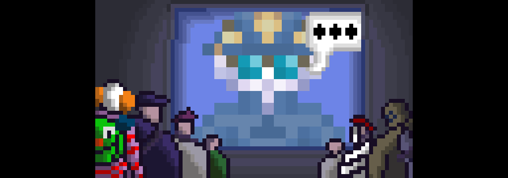

# 
 Добро пожаловать на Nemesis! 

	

	
	
	

| Ресурс                       | Ссылка                                                                       |
| ---------------------------- | ---------------------------------------------------------------------------- |
| Код                          | https://github.com/ss220-space/Nemesis/                                      |
| Руководство по модуляризации | [./modular_nemesis/readme.md](./modular_nemesis/readme.md)                   |
| Руководство по зеркалированию| [./modular_nemesis/mirroring_guide.md](./modular_nemesis/mirroring_guide.md) |
| Wiki                         | Отсутствует                                                                  |
| Документация по коду         | https://ss220-space.github.io/Nemesis/                                       |
| Discord Nemesis              | https://discord.ss220.space                                                  |
| Discord Coderbus             | https://discord.gg/Vh8TJp9                                                   |

Это Nemesis — downstream-форк /tg/station, написанный на BYOND.

Space Station 13 — пропитанная паранойей раундовая ролевая игра, действие которой разворачивается на фоне абсурдной металлической ловушки, маскирующейся под космическую станцию, с очаровательным пиксель-артом, передающим её научно-фантастический сеттинг и зловещие подтексты. Веселитесь и постарайтесь выжить!

# Загрузка

- ### [Скачивание](.github/guides/DOWNLOADING.md)

- ### [Запуск сервера](.github/guides/RUNNING_A_SERVER.md)

- ### [Карты и Away-миссии](.github/guides/MAPS_AND_AWAY_MISSIONS.md)

# Полезная документация

- ### [Правила контрибьюции](.github/CONTRIBUTING.md)
  Руководство по внесению вклада в проект, советы по работе с Github и стандарты разработки/написания кода. **Обязательно к ознакомлению!**

- ### [Руководство по стилю](/.github/guides/STYLE.md)
  Стандарты оформления кода для единообразия кодовой базы проекта.

- ### [Руководство по автодокументации](.github/guides/AUTODOC.md)
  Как оформлять комментарии для автоматической генерации документации.

- ### [Руководство по локализации](/.github/guides/LOCALIZATION.md)
  Правила и стандарты локализации, руководство по инструментам локализации. (ТРЕБУЕТ ОБНОВЛЕНИЯ!)

# Компиляция

- ### Быстрый способ
  Найдите `bin/server.cmd` в корне репозитория и запустите двойным кликом — он автоматически соберёт проект и запустит сервер на порту 1337.

- ### Долгий способ
  Найдите `bin/build.cmd` в корне репозитория и запустите двойным кликом. Сборка состоит из нескольких этапов и занимает около 1–5 минут. Когда окно закроется — сборка завершена. После этого можно [запустить сервер](.github/guides/RUNNING_A_SERVER.md) обычным способом, открыв `tgstation.dmb` в DreamDaemon.

- ### [Сборка в VSCode и другие варианты](tools/build/README.md)
  Альтернативные способы компиляции проекта.

> [!WARNING]
> Сборка напрямую через DreamMaker устарела и может вызывать ошибки, например `'tgui.bundle.js': cannot find file`.

# С чего начать?

- ### [Руководство для контрибьюторов](.github/CONTRIBUTING.md)
  Гайдлайны по внесению вклада в проект.

- ### [Гайд по разработке (HackMD)](https://hackmd.io/@tgstation/HJ8OdjNBc#tgstation-Development-Guide)
  Настройка окружения разработчика и компиляция проекта.

- ### [Общая документация по дизайну (HackMD)](https://hackmd.io/@tgstation)
  Документация по архитектуре и дизайну проекта.

- ### [Common Core](https://github.com/tgstation/common_core)
  Лор и сеттинг.

### LICENSE

---

> [!CAUTION]
> If you wish to use our code in a closed source manner (i.e. not make it available to the public and/or those who connect to services you offer using this code) you must **only** use code prior to commit [333c566b88108de218d882840e61928a9b759d8f on 2014/12/31 at 4:38 PM PST](https://github.com/ss220-space/Nemesis/commit/333c566b88108de218d882840e61928a9b759d8f), which is licenced under GPLv3.

### Click each banner for further information

---

>All code after and including commit [333c566b88108de218d882840e61928a9b759d8f on 2014/12/31 at 4:38 PM PST](https://github.com/ss220-space/Nemesis/commit/333c566b88108de218d882840e61928a9b759d8f) is licensed under the [GNU Affero General Public License version 3](https://www.gnu.org/licenses/agpl-3.0.en.html) unless otherwise specified within the folder or file.

>All code prior to commit [333c566b88108de218d882840e61928a9b759d8f on 2014/12/31 at 4:38 PM PST](https://github.com/ss220-space/Nemesis/commit/333c566b88108de218d882840e61928a9b759d8f) is licensed under the [GPL General Public License version 3](https://www.gnu.org/licenses/gpl-3.0.en.html) (including tools unless their readme specifies otherwise).

>The TGS DMAPI is licensed as a subproject under the [MIT license](https://opensource.org/license/MIT). See the footer of [code/\_\_DEFINES/tgs.dm](./code/__DEFINES/tgs.dm) and [code/modules/tgs/LICENSE](./code/modules/tgs/LICENSE) for the MIT license.
>
>Some other files are also licenced under the MIT license, these files will clearly specify this licence at the head of each file.

>All assets including icons and sound files are licensed under the [Creative Commons 3.0 BY-SA license](https://creativecommons.org/licenses/by-sa/3.0/), unless otherwise specified within the folder or file.

See LICENSE and GPLv3.txt for more details.
