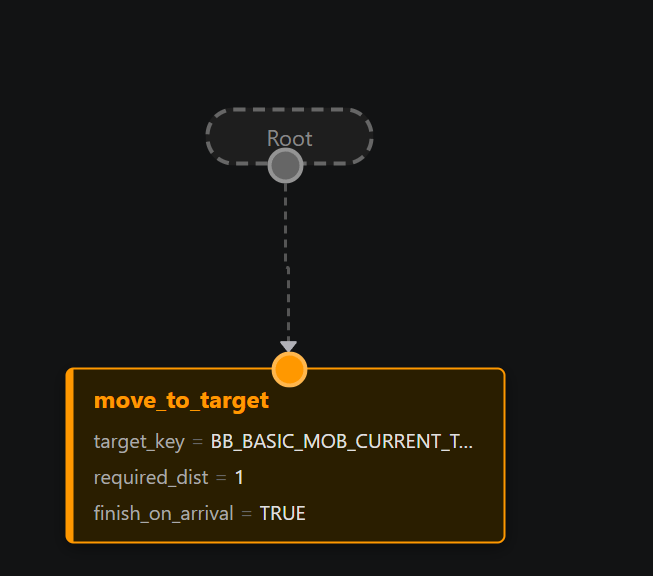
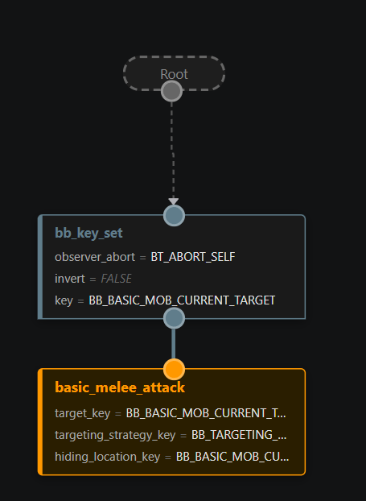
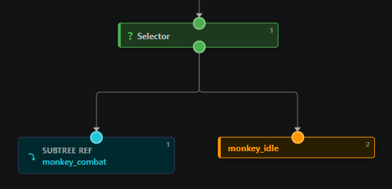
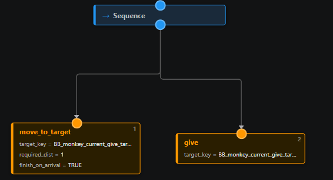
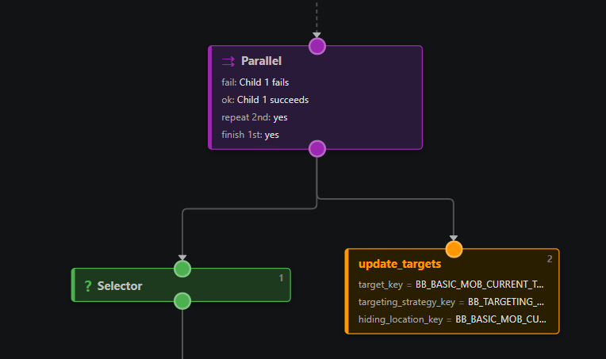
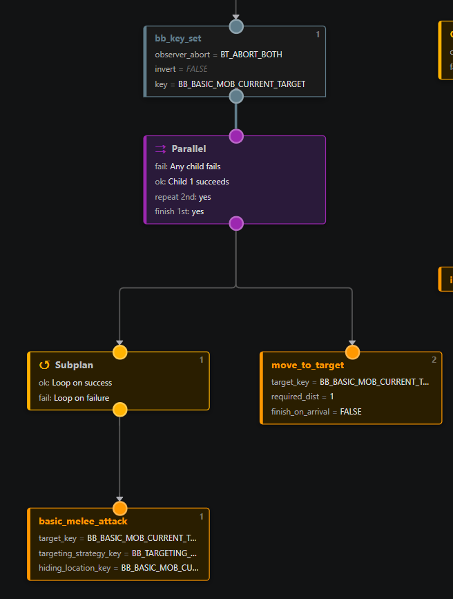
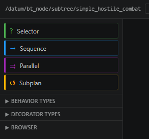

# Learn Behavior Tree AI

This file covers how the behavior tree system works in /tg/station, and how to use it in practice.

## Disclaimer

I strongly reccomend you install the "BehaviorTreeG" extension before continueing, as it is the intended way of editing behavior trees. In theory you can manually edit them, but this is strongly reccomended against due to the nature of the structure of behavior trees.

## What are behavior trees?

Behavior trees are a common pattern in game AI in which you build your AI out of a tree made out of nodes. These nodes structure and conditionalize AI behavior in a readable way.

The behavior tree runs left to right, allowing you to put high priority behavior first, and only running low priority behavior later. It also lets you sequence a series of behaviors after each other to create sensible sequences (e.g. grab key, unlock door, move through door)

## Blackboard First

The blackboard is the controller's shared memory. It makes use of an associative list to allow arbitrary keys to be assigned values.

- Nodes read keys from it to make decisions.
- Nodes write keys to it so later nodes can use those results.
- Keys are usually things like "current target", "current objective", "cooldowns", or "flags".

In essence, these are just variables. But by storing them in an associative list we do not have to have define actual variables, and our AI code can be made out of modular pieces and does not need to rely on hardcoded variables on the controller.

The keys for the blackboard are simple string defines:

example:
`#define BB_CURRENT_TARGET "Current Target"`

After this is done, you can start using the key in your behavior tree; by setting it somewhere in the tree it will automatically be added to the blackboard.

Example flow (in psuedocode):

```text
FIND TARGET LEAF:
	set BB_CURRENT_TARGET

ATTACK BRANCH:
	if BB_CURRENT_TARGET is set
  		move toward target
			attack target
```

## Behavior Tree Node

This is the parent type of all other nodes in this guide. And when active they will return one of three values:

1. BT_SUCCESS - This node succeeded, and will report this to its parent node
2. BT_FAILURE - This node failed, and will report this to its parent node
3. BT_RUNNING - This node is still running, and will report this to its parent node.

This is important for the flow of the behavior tree, as different nodes will behave differently depending on whether their children succeed or fail.

## Leaf / ai_behavior

A leaf is the behavior node, and it is what performs actual actions.

It is defined as /datum/bt_node/ai_behavior

Common leaf jobs:

- Find a target.
- Move toward something.
- Attack.
- Use an ability.
- Execute job logic (clean, heal, arrest, etc).

Example:



This moves to the target set on the selected target key, and finishes execution when arrived

## Decorator

Decorators are essentially condition checks that gate nodes behind them.

Basic use case:
Only execute combat branch if a target key is present.

Example:



This gates the attack behavior behind the BB_CURRENT_TARGET_KEY being set.

Outside of this, decorators serve a second important function, which is being able to observe the condition they are checking to see if its still valid while behavior is running in other nodes. There are two use cases for this:

1. Stop performing behavior of my children because the conditions has become FALSE (e.g. I lost my target, stop attacking!)
2. Stop performing lower priority behavior, because the condition has become TRUE (e.g. Hey I found a target! stop idling!)

You can also run observers for both of these cases at the same time.

For most decorators, we can register for signals to observe when a potential condition change might have happend, for example in the case of the target, we register on the target key being changed somewhere.

If for some reason we cannot have signals check the condition, you can also make it check every ai_controller process(), this is less efficient so use signals when possible.

## What Composites Are

Composites are structural nodes that control how child nodes run.

- They never perform behavior themselves, and exist purely to determine how nodes below them are ran.
- The composite nodes are Selector, Sequence, Parallel, and Subplan

## BT Node Types

### 1) Selector

What it does:
Tries children in order until one returns BT_SUCCEED.

To be clear; this means until the first child returns BT_FAILURE, the second child will never start.

Basic use case:
Try attacking, if you cant, perform idle behavior.



In the above example, we try to run monkey combat behavior, if for some reason this doesn't succeed (usually due to lack of target), we run idle behavior.

### 2) Sequence

What it does:
Runs children in order and stops on first failure. Basically the opposite of selector. And allows for chaining behavior that needs to happen in sequence.

Basic use case:
Move to a target, then perform work once in range.

If you fail to moving to the target, then performing work would make no sense. So a sequence is best here.



In the above example, we move to a target, and then give them our currently held item. If we fail to move to them, we also dont try to give the item

### 3) Parallel

What it does:
Runs multiple children in parallel.

This also has the option to loop the non-primary nodes (e.g. the nodes 2nd and up). This allows for behavior such as continiously checking whether we can find a target.

You also have the option to stop any secondary behavior once the primary behavior is finished. This is useful in examples where you do not wish to wait until the secondary behavior finishes.

Basic use case:
Finding targets while also performing all other behavior



Parallels also have a repeat_secondary_delay, which is a cooldown between the looping of secondary children. Ideal to cap how often certain behaviors fire (e.g. idle behavior)

### 4) Subplan

What it does:
Runs a child branch with a loop policy behavior.

This essentially allows us to prevent the child from returning its return value to its parent, and instead try to loop.

This is useful for things like combat and prevents redundant replanning of the entire plan. You can basically do "Hey, if you fail to hit someone this time, try again next time until you succeed".

If doing this, its important to make use of observers on decorators to make sure you can exit the subplan, else you can get stuck in an endless cycle of behavior.

Basic use case:
In combat, keep retrying attack logic instead of ending after one attempt.



In the above example, we are running a combat behavior where we first check if our target is set, (and have an observer that cancels if the condition changes).

Then, we run a parallel; on the left side (primary) we have a subplan that runs a looping attack behavior; if this attack behavior fails (We're not close or some other issue), the sub-plan will just try again next tick.

In the secondary branch, we try to move to the target. (and keep trying this as well, due to the parallels looping rule)

Due to us having the observer, if for some reason our target changes due to being changed by another node, the decorators observer will re-evaluate and cancel the plan. Without an observer, this behavior would be stuck in an endless loop.

Subplans also expose `loop_delay`, which when set causes a delay between each loop of the behavior, essentially a cooldown. It can be useful to gate things like idle behavior without triggering re-planning

## Quick Node Selection Guide

- Use leaf when you want to do one concrete action.
- Use selector when branches are alternatives.
- Use sequence when steps are ordered dependencies.
- Use parallel when you need concurrent actions
- Use decorator when a branch should only run behind a condition or should react to a condition changing.
- Use subplan when a child branch should loop on succes and/or failure.

## Subtrees

Subtrees are essentially modularized pieces of tree that can be re-used in different trees. This allows for patternizing common behaviors into a re-useable tree.

One feature of subtrees is that if you are making a subtree, and want to change something when using the subtree depending on the AI, you can assign any field in the subtree as a binding; this makes it editable in any controller (or subtree) that the subtree is used.

You can also re-assign subtrees by setting an "Override ID". By doing this you can call `controller.set_behavior_tree_override()` with the same ID to change what subtree is used in this node. Used in for example pet commands to tell a dog to go fetch dynamically.

## Editor

The behavior tree editor can be opened via opening one of our .bt.json files. These .bt.json files are specialized json files that format our (sub)trees. In theory these jsons are human-readable, but the editor makes it much easier to parse them. The editor only edits the .bt.json file itself.

When opening the editor, you should press "Refresh Types" at the top, this will make the editor parse through all the relevant .dm files to find defined behaviors, decorators, subtrees and ai controllers. You should also run this if you modify or add new nodes, else your cache will be out of date.

Now, you should be able to see the tree in front of you. In this view you can re-order nodes, add new ones, and change parameters on individual nodes.

On the left, you can find a palette of all the nodes you have. The compsoite nodes are found in the top left, while the rest are distributed across 3 browsers:

1. Behavior types (Leaf / ai_behavior nodes)
2. Decorator types (Decorator nodes)
3. Browser (All ai_controllers and subtrees)



You can drag these nodes into the node-graph to place them.

You can also change the nodes connections by dragging from either end to another node. This system is currently a bit fidgetty while I figure out how to become a better editor programmer.

Once you are done with your tree, be sure to save the file. You can now compile and the JSON will be converted automatically

## Targeting

A huge amount of AI work boils down to finding a thing nearby and remembering it. Finding an enemy, finding food, finding a beacon to walk to. Instead of writing a brand new "find" leaf every time, we have one generic leaf that you configure with two helpers. You almost never need to write a new leaf for this.

The three pieces:

1. **The leaf** is `update_interaction_target` or `update_targets`. Its job is to look around, find something, and write it to a blackboard key.
2. **A target source** answers the question "what candidates exist?". It gathers a list of nearby things, such as everything in view, only things of a certain type, or items in your hands.
3. **A targeting strategy** answers the question "is this specific candidate valid?". It looks at one candidate at a time and says yes or no.

So the flow is: the **source** hands the leaf a list of candidates, the leaf runs each one past the **strategy**, and the first one that passes gets written to your target key.

You configure all of this on the leaf node.

```text
LEAF: update_interaction_target
	target_key:          BB_TARGET_FOOD          (where to store what we found)
	target_source:       .../held_items_then_oview/basic_foods   (what to look at)
	targeting_strategy:  .../anything            (how to decide it's valid)
	vision_range:        7                        (how far to look, optional)
```

A few pitfalls:

- **Finding nothing is just a FAILURE.** If the source returns an empty list, the leaf simply fails.
- **Use `/datum/targeting_strategy/anything` if you don't filter for specifics.** With this strategy the only thing we check is `get_dist`, which is enough when the source already gives you the specific candidates you want.
- **Reuse before you build.** There are many existing sources and strategies. Use these before adding new ones.

Once the target key is set, the rest of your tree reacts to it the way you've already seen. A `decorator` gates the combat branch behind "is the target key set?". An observer on this decorator can cancel lower priority behavior when the target is set, or cancel its own behavior when the target is lost.

> Note: combat target _searching_ during a fight is usually done by the `update_targets` leaf, which keeps `BB_CURRENT_TARGET` refreshed while you fight. `update_interaction_target` is the general-purpose "go find a thing" leaf for everything else.
