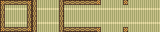
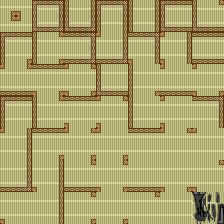
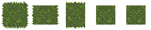
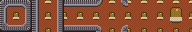
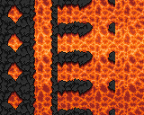

## Guide to the icon cutter

### What are cut icons?

There are some icons in ss13 that are essentially stitched together from a smaller set of icon states.

Smoothing is a prime example of this, though anything that takes a base image and operates on it fits the system nicely.

### How does the cutter work?

The cutter has a bunch of different modes, different ways to operate on images. They all take some sort of input, alongside a (.toml) config file that tells us what to DO with the input.

The .toml file will know the cutter mode to use, alongside any config settings. Smoothing configs can use templates instead of copying out a bunch of information, templates are stored in the cutter_templates folder.

The toml file will be named like this. `{name}.{input_extension}.toml`. So if I have a config mode that uses pngs as input (almost all of them) it'll look like `{name}.png.toml`

It'll then use the `{name}.png` file to make `{name}.dmi` (or whatever the cutter mode outputs)

You should NEVER modify the cutter's output, it'll be erased. You only want to modify the inputs (configs, pngs, etc). 

As I mentioned our cutter has several different modes that do different things with different inputs.

Most cutter stuff in our repo uses the BitmaskSlice mode, you can find info about it [here](https://github.com/actioninja/hypnagogic/blob/master/examples/bitmask-slice.toml)

## Bitmask Smoothing (BitmaskSlice)

We use bitmask smoothing to make things in the world merge with each other, "smoothing" them together.

This is done by checking around these objects for things that we want to smooth into, and then encoding that as a set of directions.
Now, we need icon states for every possible combination of smoothing directions, but it would be impossible to make those manually.

So instead we take a base set of directions, typically no connections, north/south, east/west, north/south/east/west, and all connections, and then slice them up and stitch them together.

Looks something like this

>Example: [Bamboo](turf/floors/bamboo_mat.png.toml)
>
> png of 32x32 blocks, representing connections.
>
> [None, North + South, East + West, North + South + East + West, All]
>
>
>
> And its output dmi
>
>

### How do I modify a smoothed icon?

Modify the png, then recompile the game/run build.bat, it will automatically generate the dmi output.

### How do I make a smoothed icon?

Make a png file called `{dmi_name}.png`. It should be 5 times as wide as the dmi's width, and as tall as the dmi's height

Create a config file called `{dmi_name}.png.toml`, set its [template](../cutter_templates/bitmask) to the style you want. Don't forget to set the output_name var to the base icon state you're using.

Once you're done, just run build.bat or recompile, and it'll generate your cut dmi files for you.

If you want to make something with nonstandard bounds you'll need to set the relevant variables, you can read the examples found [here](https://github.com/actioninja/hypnagogic/tree/master/examples) to understand different mode's configs.

> Example: [Grass (50x50)](turf/floors/grass.png.toml)
>
>

If you want to give a particular smoothing junction a unique icon state use the prefabs var, add a new "state" to the png, and modify the config so it knows how to use it.

> Example: [Donk Carpets (Big Pocket)](turf/floors/carpet_donk.png.toml)
>
>

If you want to make the smoothed icon animated, add another row of states below your first one. Each new row is a new frame, you define delays inside the config file as deciseconds.

> Example: [Lava (Animated, 4 Frames)](turf/floors/lava.png.toml)
>
>
